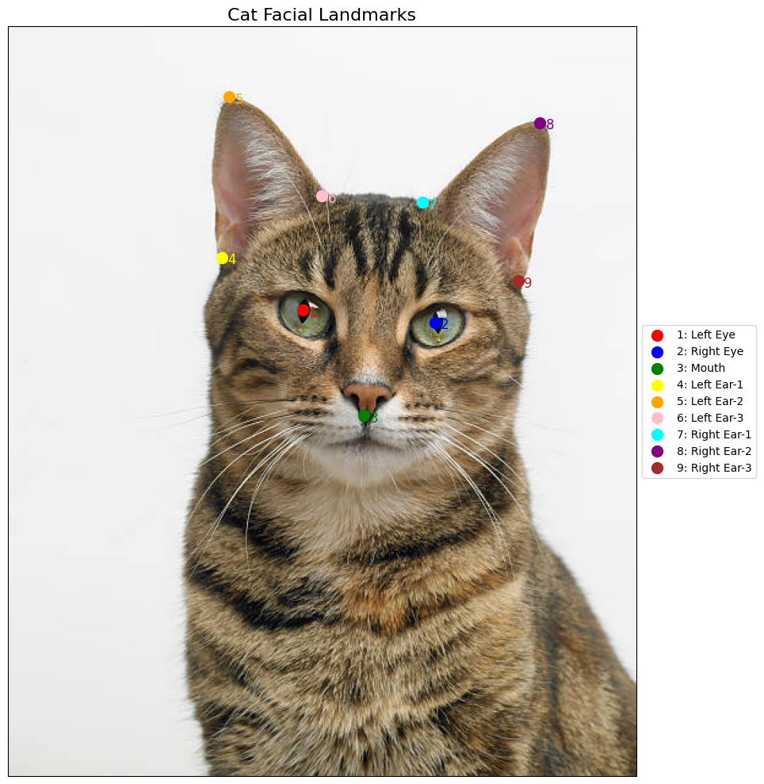
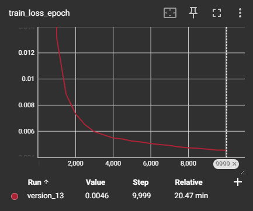
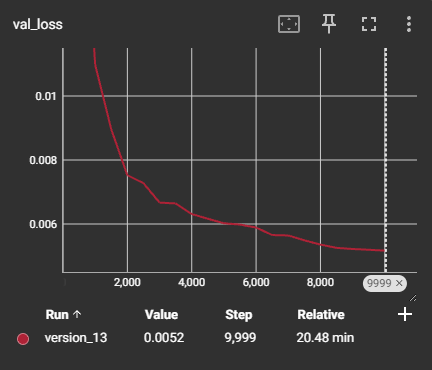
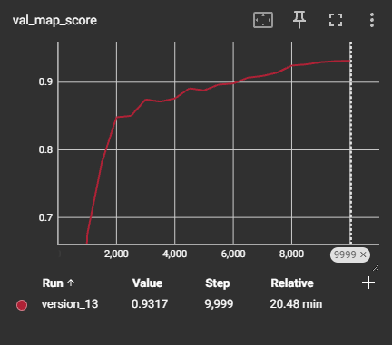
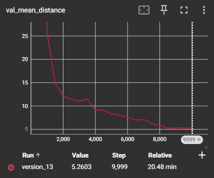

# IUVO Cat Landmark Detection API

<p align="center">
  
</p>

## Model Performance

<div align="center">
  <div style="display: inline-block; text-align: center;">
    
    <p><i>Training Loss</i></p>
  </div>
  <div style="display: inline-block; text-align: center;">
    
    <p><i>Validation Loss</i></p>
  </div>
</div>

<div align="center">
  <div style="display: inline-block; text-align: center;">
    
    <p><i>Validation mAP</i></p>
  </div>
  <div style="display: inline-block; text-align: center;">
    
    <p><i>Validation Mean Distance</i></p>
  </div>
</div>

## Docker Setup

### Building the Docker Image
```bash
# Build the Docker image
docker build -t cat-landmark-api .
```

### Running the Container

```bash
# Run the container
docker run -p 8000:8000 cat-landmark-api
```

The API will be available at `http://localhost:8000`

## API Usage

### Detect Landmarks

**Endpoint:** `POST /detect-landmarks`

**Request Body:**
```json
{
  "image_url": "https://example.com/cat.jpg"
}
```

**Response:**
```json
{
  "landmarks": {
    "left_eye": [120, 145],
    "right_eye": [180, 145],
    "mouth": [150, 200],
    "left_ear_1": [100, 80],
    "left_ear_2": [90, 70],
    "left_ear_3": [80, 60],
    "right_ear_1": [200, 80],
    "right_ear_2": [210, 70],
    "right_ear_3": [220, 60]
  }
}
```

### Example with curl

```bash
curl -X POST "http://localhost:8000/detect-landmarks" \
     -H "Content-Type: application/json" \
     -d '{"image_url": "https://media.istockphoto.com/id/157671964/photo/portrait-of-a-tabby-cat-looking-at-the-camera.jpg?s=612x612&w=0&k=20&c=iTsJO6vuQ5w3hL5pWn42C91ziMRUsYd725oUGRRewjM="}'
```
